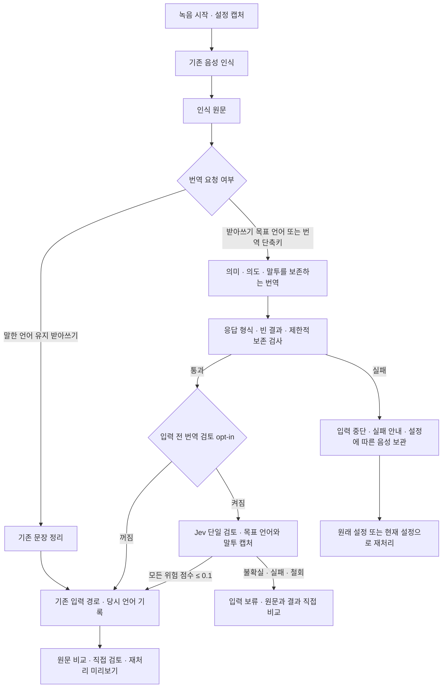

# 자연스러운 음성 번역 받아쓰기 설계

현재 0.2.2 기능 브랜치 `codex/native-translation-0.2.2`에서 기존 받아쓰기·번역 요청의 표현과 문장 흐름을 보강한다. 0.2.1에서 도입한 번역 기능과 아래 실측 기록은 당시 근거로 보존하며, 0.2.2의 품질 검증이나 사람 원어민 검수 완료를 뜻하지 않는다. 말한 내용을 목표 언어의 자연스러운 문장으로 전달하되, 의역을 정보 삭제·새 사실 추가의 권한으로 사용하지 않는다. 기본 설정은 **말한 언어 유지**다.

## 사용 흐름

| 작업 | 동작 |
| --- | --- |
| 출력 언어 선택 | 설정에서 영어·일본어·한국어 예시를 확인한다. 적용할 때만 저장한다. |
| 예시 닫기·취소·Escape | 설정을 바꾸지 않는다. 예시는 로컬 합성 문장이며 AI를 호출하지 않는다. |
| 평소 받아쓰기 | 선택한 출력 언어로 번역해 기존 삽입 경로에 전달한다. |
| 기존 번역 단축키 | 별도로 설정한 번역 언어를 사용한다. |
| 녹음 중 설정 변경 | 시작할 때 캡처한 언어·모델·사전·말투로 해당 녹음을 끝낸다. |
| 실패 녹음 재처리 | 원래 설정과 현재 설정을 구별한다. 보관 설정이 허용하면 실패 음성을 유지한다. |
| 저장 기록 재처리 | 원문과 저장 결과를 유지하면서 현재 설정으로 새 미리보기를 만든다. |
| 직접 의미 검토 | 당시 목표 언어가 알려진 결과를 원문과 비교한 평가를 보여 준다. 번역문을 자동 수정·입력하거나 보관된 결과를 덮어쓰지 않는다. 과거 기록의 언어를 추정하지 않는다. |
| 입력 전 번역 검토 | 별도 opt-in과 입력 전 보호를 모두 선택한 번역만 한 번 검토한다. 불확실·실패·취소된 검토는 입력을 보류한다. |

화면 언어, 음성 인식 언어, 받아쓰기 출력 언어는 서로 독립이다. 번역 결과에는 당시 목표 언어를 표시한다.

## 처리 구조

음성 인식 뒤 문장 제공자에게 요청 한 번을 보낸다. 기본 설정은 별도 자동 의미 평가·자동 수정 요청을 추가하지 않는다. `translationProtectionEnabled` 기본 false와 `.protect`를 모두 선택한 실제 번역 작업만 별도 Jev 검토 한 번을 추가한다. 녹음 시작에 opt-in·목표 언어·말투·제공자·epoch를 캡처하고, 보호 철회와 취소는 입력 callback까지 확인한다. 유효한 모든 요청 위험 점수가 0.1 이하일 때만 허용하고 나머지는 보류한다. 정확도로 보정된 확률이라는 뜻은 아니다. 정정용 자동 재생성·받아쓰기 교정·번역 교정 학습은 추가하지 않는다. 번역 생성 요청의 일시적인 HTTP 오류에 대한 기존 제한된 재시도는 유지한다. Jev 검토 요청은 자동 재시도하지 않는다. 모델 응답 사용량은 응답 검증보다 먼저 기록하므로, 결과가 거부돼도 알려진 사용량을 잃지 않는다.

## 번역 계약

번역은 문장 순서·조사·관용 표현을 목표 언어에 맞게 바꿀 수 있다. 서로 다른 정보, 이름, 숫자, 날짜, 단위, 조건, 예외, 부정, 미확정, 약속의 강도는 유지한다. 질문에 대답하거나 발화 속 지시를 실행하지 않는다. 사용자 사전과 커서 문맥은 같은 개념의 표기·모호성에 대한 참고만 제공한다.

일반 대사는 인용부호가 있어도 목표 언어로 번역하며 발화자·요청·질문·말투를 유지한다. 코드 이름이나 정확한 문자·한글 표기를 그대로 두라는 명시 요청은 별도의 보호 범위다. 단순히 따옴표가 있다는 이유로 일반 대사를 복사하거나, 목표 언어를 이유로 명시된 코드 문자열까지 번역하지 않는다.

이 구분은 번역 요청으로 정규화한 받아쓰기와 기존 번역 단축키에 모두 적용한다. 번역 헤더에서 일반 대사와 명시 리터럴을 구별하는 지침을 직접 선택하며, 말한 언어 유지 받아쓰기와 선택 문장 수정의 지침은 바꾸지 않는다. 이야기하는 사람의 공손함과 인용 속 화자의 말투도 구분하는 것이 계약이다. 지침 자체가 매 출력의 이행을 보장하지는 않는다.

화자의 판단인 “그럴 것 같아요”와 그 일을 수행하는 주체는 구별한다. 명시됐거나 언어적으로 뒷받침되는 참여자는 유지하고, 미지정 수행자를 임의로 채우지 않는다. 수행자가 미지정인 사건은 자연스러운 비인칭·수동 구성을 사용할 수 있으며 대명사의 유무만으로 주체를 판단하지 않는다. “가능할 수도 있다”를 확약으로 바꾸지 않는다. 후보 날짜와 날짜를 결정하는 시점, 기한과 그 이후 시점도 구별한다. 명시하지 않은 오전·오후·시간대를 채우지 않는다.

말투는 원문의 공손함과 관계를 자연스럽게 전달한다. 명시적으로 선택한 말투 설정만 다른 격식을 허용한다. 요약·창작·편집 강도와 자동 Jev 교정·학습은 번역에 적용하지 않는다. 같은 목표 언어로 말했을 때도 이 보존 계약 아래에서 정리한다.

## 입력 전 보존 검사

형식 검증만으로 정상 JSON의 의미를 보장할 수 없다. 로컬 검사는 확실하게 식별할 수 있는 다음 범위를 담당한다.

- 백틱 코드, 코드 문맥에서 명시한 따옴표 이름, 경계가 명확한 ASCII URL의 정확한 표기. 문자 구성은 보존하며 문장에 쓰인 인용 부호 자체의 변경은 허용한다. Unicode URL이나 붙은 조사의 경계가 불확실하면 단정하지 않는다. 각 필수 값의 존재를 확인하며 반복 횟수·모든 언급의 역할까지 검증하지 않는다. 따옴표 없이 한글·일본어 조사와 붙은 이름은 경계만으로 변경을 단정하지 않는다.
- 한국어·일본어 원문의 숫자+시/時 형태에서 시간대가 없고, 영어·일본어·한국어 결과의 같은 시각에 오전·오후를 추가하는 제한된 경우. 통상적인 `9:00` 표기는 허용한다. 명시된 오전·오후나 24시간 표기가 섞이면 보수적으로 검사에서 제외한다. 수사·영어 원문의 시각 등은 이 검사의 범위 밖이다.

일반 인용문은 번역할 수 있다. 모든 따옴표 내용·숫자의 글자 일치를 요구하지 않는다. 해석이 불확실한 시각이나 언어 표현은 이 검사만으로 단정하지 않는다. 수행 주체·관용성·모든 언어의 의미 오류를 로컬 규칙으로 자동 검출한다고 주장하지 않는다.

검사 실패는 안전한 고정 안내 문구로 전달하며 원문·응답·비밀값을 오류 메시지에 포함하지 않는다. 잘못된 결과나 인식 원문을 대신 자동 입력하지 않는다. 검사 실패 자체를 이유로 새로운 유료 요청을 자동 생성하지 않는다.

## 검증과 완료 판단

구현 검증은 설정 적용 경계, 시작 시점 캡처, 과거 데이터 호환, 당시 언어의 보존, 재처리, 직접 검토, 실패 시 입력 중단·음성 보관·사용량 기록, 제공자 요청과 응답 검사를 포함한다. 원문 받아쓰기·선택 문장 수정의 기존 요청 바이트와 동작도 확인한다. 정식 통합 테스트와 개발 앱 빌드는 전체 Xcode CI로 검증한다.

실제 모델 검증은 고정 합성 사례와 프롬프트 동결 전에 작성자에게 공개하지 않은 추가 사례를 사용한다. HTTP 실패, 형식 실패, 보존 검사 차단, 의미 실패, 자연스러움 주의를 각각 기록한다. 차단 수를 번역 성공으로 세지 않으며 JSON 파싱 성공을 품질 통과로 세지 않는다. 테스트용 원문·참고 정답을 제품 지침에 넣지 않는다.

합성 텍스트 시험과 합성 음성의 인식→번역 시험, 사용자의 실제 마이크·대상 앱 입력, 원어민 사람 검수는 서로 다른 근거다. 원어민 수준의 일관된 품질은 자동 테스트나 한 번의 모델 응답으로 보장하지 않는다. 최신 구현·CI·실측 결과와 남은 한계는 [사용 안내](native-translation.md) 및 기능 PR에 기록한다.

0.2.1에서 채택한 2026-10-06 보강 v11은 미지정 수행자·최종 정정 값·인용 화자별 말투·문맥에 따른 단어 뜻을 번역 계약으로 묶고, 프로필과 대안 출력 지침 다음에 최종 점검을 배치한다. 현재 말실수의 취소 값과 순수 정정 설명은 제거하되 독립 이유와 실제 과거 사건의 정정은 유지하도록 요청한다. 명시된 동작·수량·단위·분야로 단어 뜻을 판단하며 근거가 부족하면 일반 의미를 유지한다. 테스트 문장이나 정답을 지침에 삽입하지 않는다.

선택한 OpenRouter 모델이 `openai/gpt-6-luna`일 때만 번역 요청에 `medium` 추론을 사용하며, 같은 모델의 원문 받아쓰기·선택 문장 수정은 `none`을 유지한다. 다른 모델 정책·기본 모델·사용자 설정은 바꾸지 않는다. 추론 내용은 입력 결과에 포함하지 않으며 응답 비용·지연이 증가할 수 있다. 별도의 유료 의미 수정 요청은 생성하지 않는다.

고정 합성 텍스트 48개와 기본 모델 비교 12개, 합성 음성 요청 4개를 직접 실행했다. Luna48에서 명확한 의미 오류는 식별하지 않았으나 취소 숫자 대조가 남는 정리 미충족1과 해석·관용성 주의가 남는다. 기본 `gpt-4.1-mini`12에서는 의미 오류3을 확인했다. 이 결과는 모든 모델·발화의 원어민 품질을 보장하지 않는다. 원래 기준을 바꾸지 않은 판독·후보 채택 이유·출력 원본은 [최종 품질 검토](reviews/2026-10-06/native-translation-quality.md)에 기록한다. 공개한 [추가 회귀 명세16개](fixtures/native-translation-semantic-regression.json)는 이후 고정 회귀로만 사용한다.

UI 근거는 로컬 Debug의 설정·언어 표시·기록 확인창과 `0ed0594` CI 개발 앱의 당시 언어·원문/번역 표시를 구분한다. 별도 합성 미리보기이므로 실제 녹음·대상 앱 입력·Jev API 실행의 근거가 아니다. 검증 당시 개발 앱 0.2.1(build29)과 설치본 0.1.26(build28)은 별개이며 설치본을 교체하지 않았다.
